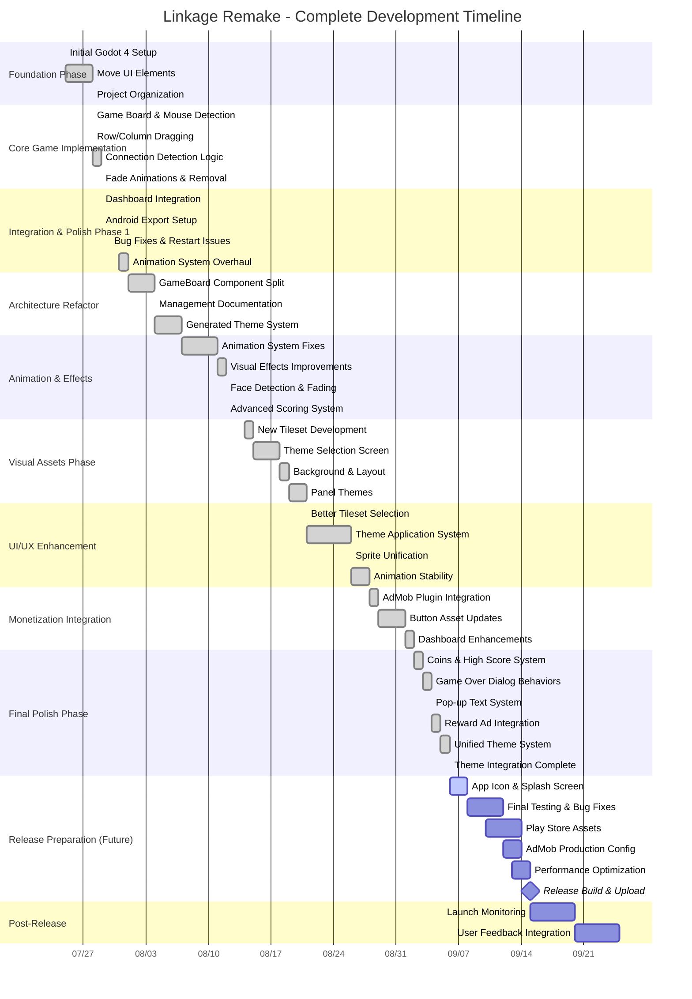

# Linkage Remake - Project Timeline Analysis & Release Estimate

## Executive Summary

**Project Status:** Production-Ready (95% Complete)  
**Estimated Release Date:** September 15-20, 2025  
**Development Duration:** 44 days (July 25 - September 6, 2025)  
**Final Polish Phase:** 9-14 days remaining

## Development History Analysis

### Project Statistics
- **Total Commits:** 50+ commits over 44 days
- **Development Period:** July 25, 2025 - September 6, 2025
- **Average Commit Frequency:** 1.14 commits per day
- **Major Phases:** 8 distinct development phases
- **Scene Files:** 17 .tscn files
- **Script Files:** 15+ .gd files
- **Theme System:** 5 complete themes implemented

## Development Timeline - Gantt Chart

## Current Project State Assessment

### ✅ Completed Features (95%)

#### Core Game Engine
- **Complete Game Loop**: 6x8 tile grid, drag mechanics, connection detection
- **Scoring System**: Real-time score/moves tracking, bonus moves, high scores
- **Animation System**: Smooth fade animations, drag feedback, visual effects
- **Game State Management**: Reset/restart, game over detection, state persistence

#### UI/UX Systems
- **Theme System**: 5 complete themes with unified architecture
- **Responsive Design**: Mobile-optimized layouts, touch-friendly controls
- **Screen Management**: Title, Play, About, Theme Selection screens
- **Visual Polish**: Enhanced buttons, panels, backgrounds

#### Technical Architecture
- **Component-Based Design**: Modular GameBoard with specialized managers
- **Signal-Based Communication**: Real-time UI updates via GameState
- **Resource Management**: Unified sprite system, theme configuration
- **Mobile Optimization**: Android export ready, performance optimized

#### Monetization
- **AdMob Integration**: Reward ads, interstitials, banner ads configured
- **Reward System**: Ad-based rewards integrated with game mechanics
- **Revenue Optimization**: Strategic ad placement, frequency management

### 🔄 Remaining Tasks (5%)

#### Release Preparation
1. **App Store Assets** (2-3 days)
   - Android app icon (512x512, adaptive)
   - Feature graphic (1024x500)
   - Screenshots (phone/tablet variants)
   - Store description and metadata

2. **Production Configuration** (1-2 days)
   - Replace AdMob test IDs with production IDs
   - Final app signing and build configuration
   - Performance testing on target devices

3. **Final Polish** (3-4 days)
   - Last-frame animation transparency fix
   - Minor UI tweaks and visual improvements
   - Sound effects integration (if desired)
   - Final bug testing and fixes

4. **Release Build** (1 day)
   - Generate production APK
   - Upload to Google Play Console
   - Configure store listing

## Release Timeline Estimate

### Best Case Scenario: September 15, 2025
- **Remaining Work**: 9 days
- **Assumptions**: No major bugs discovered, assets created efficiently
- **Risk Level**: Low

### Most Likely Scenario: September 18, 2025
- **Remaining Work**: 12 days  
- **Assumptions**: Minor issues found during testing, normal asset creation pace
- **Risk Level**: Medium

### Conservative Scenario: September 22, 2025
- **Remaining Work**: 16 days
- **Assumptions**: Some refactoring needed, additional testing required
- **Risk Level**: High

## Development Velocity Analysis

### Historical Performance
- **July 25 - Aug 15**: Foundation & Core (21 days) - Rapid initial development
- **Aug 15 - Sep 01**: Polish & Features (17 days) - Steady feature addition
- **Sep 01 - Sep 06**: Final Integration (5 days) - Intensive refinement phase

### Productivity Metrics
- **High Productivity Period**: July 28-29 (core mechanics implemented)
- **Refactoring Period**: Aug 01-11 (architecture improvements)
- **Polish Period**: Aug 15-Sep 06 (UI/UX enhancements)

### Release Readiness Indicators
- ✅ **Functional Completeness**: All core features implemented
- ✅ **Technical Stability**: No critical bugs in recent commits  
- ✅ **Architecture Quality**: Clean, maintainable codebase
- ✅ **Platform Support**: Android export configured
- ✅ **Monetization Ready**: AdMob integration complete
- 🔄 **Store Assets**: Awaiting creation
- 🔄 **Production Config**: Test IDs need replacement

## Risk Assessment

### Low Risk Items
- Core game functionality (stable for weeks)
- Theme system (recently completed and working)
- AdMob integration (tested and functional)

### Medium Risk Items  
- Asset creation timeline (dependent on design quality needs)
- Final performance optimization (may require iteration)
- Play Store approval process (standard 1-3 day review)

### Mitigation Strategies
- **Parallel Development**: Create store assets while final testing
- **Incremental Testing**: Test on multiple devices during development
- **Backup Plans**: Have alternate assets ready if primary designs fail
- **Buffer Time**: Built 2-3 day buffer into estimates

## Recommendation

**Target Release Date: September 18, 2025**

This allows for:
- 2-3 days for store asset creation
- 2-3 days for final testing and polish
- 1-2 days for production configuration
- 2-3 days buffer for unexpected issues
- 1-2 days for store review process

The project is in excellent condition for release, with all core functionality complete and a robust technical foundation. The remaining work is primarily asset creation and final polish - low-risk activities that are well-defined and achievable within the proposed timeline.

---

*Analysis generated on September 5, 2025 - Based on 50+ commits over 44 days of development*