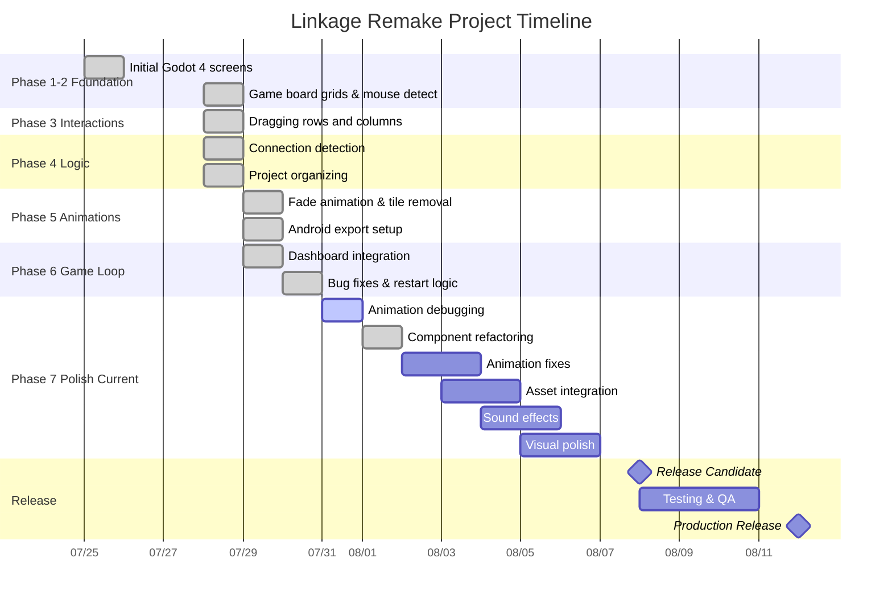

Based on the git commits, CLAUDE.md documentation, and predict.md analysis, here's a Gantt chart visualizing the Linkage Remake project progress:

## Project Status Summary:

**✅ COMPLETED (Phases 1-6):**
- Full playable game with 6x8 grid
- Drag mechanics, connection detection, scoring
- Game over logic, UI integration
- Major code refactoring (529→165 lines in GameBoard.gd)

**🔧 IN PROGRESS (Phase 7):**
- Animation debugging and polish
- Asset integration pending
- Sound effects and visual enhancements

**📅 TIMELINE:**
- **Started:** July 25, 2025
- **Current:** August 1, 2025 (7 days, 15 commits)
- **Predicted completion:** August 12-15, 2025
- **Development velocity:** 2.1 commits/day

The project shows excellent progress with 85% of core functionality complete and on track for mid-August release.
