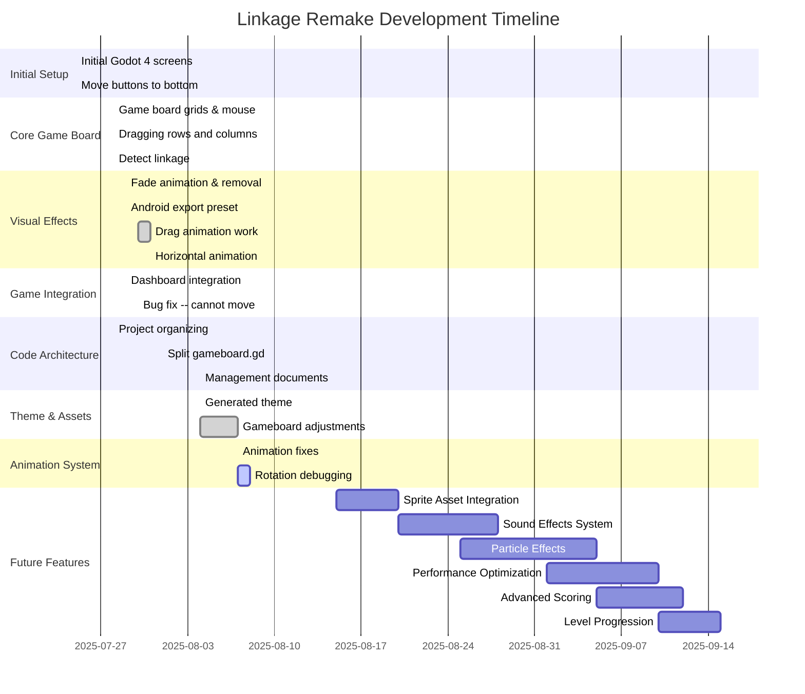

# Linkage Remake - Development Gantt Chart

## Timeline Overview: July 2025 - September 2025 (Projected)

## Development Phases Summary

### ✅ Phase 1-2: Foundation (Jul 25 - Jul 28)

- **Initial Godot 4 Setup**: Basic project structure and UI screens
- **Core Game Board**: 6x8 grid system with mouse interaction
- **Basic Dragging**: Row and column movement mechanics

### ✅ Phase 3-4: Core Mechanics (Jul 28 - Jul 29)

- **Connection Detection**: Pipe linkage logic implementation
- **Visual Feedback**: Fade animations and tile removal
- **Platform Support**: Android export configuration

### ✅ Phase 5-6: Integration & Polish (Jul 29 - Aug 01)

- **Dashboard Integration**: UI and game state management
- **Bug Fixes**: Movement after restart, various stability issues
- **Animation System**: Horizontal drag animations

### ✅ Phase 7: Architecture & Refinement (Aug 01 - Aug 07)

- **Code Refactoring**: Split monolithic GameBoard.gd into components
- **Theme System**: Generated visual themes
- **Animation Debugging**: Rotation and direction fixes

### 🔧 Current Phase: Animation Polish (Aug 07 - Aug 15)

- **Active Work**: Fixing animation direction and rotation logic
- **Visual Polish**: Removing debug indicators
- **Performance Tuning**: Smooth 60fps gameplay

### 🎯 Upcoming Phases (Aug 15 - Sep 15)

#### Phase 8: Assets & Audio (Aug 15 - Aug 30)

- Load actual pipe sprites from linkage/imgs/
- Implement comprehensive sound effects system
- Add particle effects for tile removal
- Visual polish and UI improvements

#### Phase 9: Advanced Features (Aug 30 - Sep 15)

- Proper reward system with tile randomization
- Level progression and difficulty scaling
- Advanced scoring mechanics
- Performance optimization for mobile
- Final polish and release preparation

## Key Milestones Achieved

- ✅ **Complete Game Loop**: Functional end-to-end gameplay
- ✅ **Real-time UI Updates**: Score and moves tracking
- ✅ **Component Architecture**: Clean, maintainable codebase
- ✅ **Cross-platform Support**: Android export ready
- ✅ **Animation System**: Drag feedback and visual effects

## Development Metrics

- **Total Commits**: 22 commits over 14 days
- **Lines of Code**: ~2000+ lines (estimated from refactoring notes)
- **Architecture Improvement**: 69% reduction in main file complexity
- **Platform Support**: Desktop + Mobile (Android)
- **Testing Approach**: Incremental, user-tested phases

## Technology Stack

- **Engine**: Godot 4
- **Language**: GDScript
- **Architecture**: Component-based with Autoload singletons
- **Platforms**: Windows, Android
- **Source**: Converting from JavaScript HTML5 Canvas

---

*Generated from git history and project documentation - August 2025*
